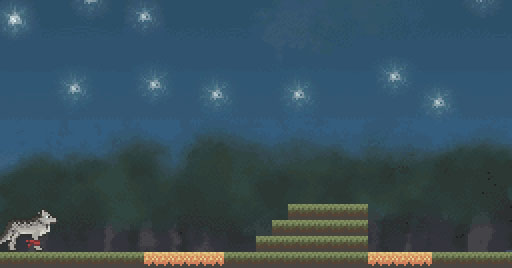

Projects:

https://haestflod.github.io/school-projects/

### Cubes are acute
An rts developed in 2011 in 3D where you can build & control units to fight.
There is an AI that can play versus each others or versus the player.

Me, Martin and Jonathan worked on this project together.

### Pathfinding
A* pathfinding implementation in 2011. There are 2 maps in the project to test against.  

This is also a breath & depth first implementation.
The A* Pathfinding is originally written by Martin for Cubes are acube project that I modified this pathfinding project.

### BoardGame
A turn based strategy game board game we made in a 5man project in early 2012. 
I focused on database modeling, game design and game logic in PHP and javascript.

This uploaded project only has the game logic.

The database stored all a players move + the random seed making the game completly deterministic.
The game can be tested here by mocking out the database & website: https://haestflod.github.io/school-projects/projekt/BoardGame/spelplan/testingGame.html

### Nintendo DS
I made a game for the Nintendo DS using a homebrew developer kit. 
Here's a picture of the game. 
The source code is sadly gone.
